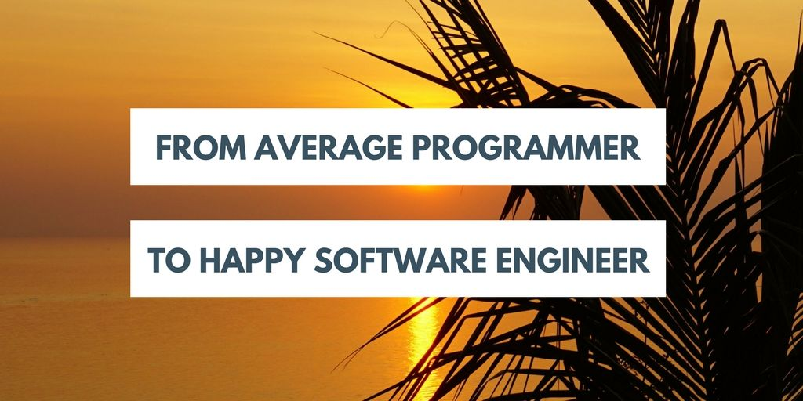

> A few words about self-development.

My goal is to show you how to be happy as a software engineer. It doesn't matter if you are senior or junior. The absolute must is a constant, never-finished **self-development**. There is no other way in our profession. Technologies that we are working with are changing and developing all the time. New versions of programming languages, libraries, and frameworks (almost) always bring new possibilities, better performance and improving our everyday work life. Thanks to that, we can create more, better, faster and easier. As an employer always favor people who want to learn more and they admit to gaps in their knowledge but they are willing to fill them. However, avoid people who claim that they already know everything. They will cause you only troubles.

Now, attention, please. This is important. Self-development of a great programmer **is not only about improving your technical skills(!)**. Of course, your technical knowledge and experience are important but let's consider following examples:

* so what, if you've implemented hundreds of features in a product that no one needs?
* so what, if your backend is optimized for performance while the user interface is terrible and no one knows how to use your app?
* so what, if you are using all the latest and coolest technologies while you are losing your health and friends to over-hours in a badly managed project?
* so what, if you know by heart the whole ECMAScript specification while no one from your team understands what you are talking about?
* so what, if you configured servers to handle millions of request per second while your boss is not able to pay your next salary?

Above examples are presenting mistakes in a few areas related to a job of a programmer:

* product development,
* user interface and user experience (UI and UX),
* project management,
* soft skills,
* business.

**If these topics are related to our profession, would be great to have at least some basic knowledge about them**.

Why do we need this knowledge? I assure you, it will change a lot in your life. In your everyday job, you will not only think **_what_** to do, but you will start considering **_why_**. You will start asking questions, sometimes hard for your managers. You will stop accepting silly ideas forced on you. You will start seeing things that you have missed before. You will deliver solutions instead of being a "production line worker". As a result, you will do your job better and more consciously. You will feel better and more worthy. Your employer will appreciate you more and will give you more challenging and responsible tasks.

**That is how an average programmer is becoming a true software engineer. They can deliver solutions to their employer (or client) problems.**

I want to talk now about a big issue I see in our profession. **Many companies don't treat us as experienced engineers but as a labor force of XXI century, new production line workers**. And I must say, this is our fault. We are stuck to our computers and desks, typing thousands of lines of unnecessary code just because someone told us to do it.

Let's digress now and think about a profession of a construction engineer. Their job is to build a bridge. From the beginning of the project they know where the bridge should be placed and what is the expected traffic it should handle. Our construction engineer prepares the project based on the input data. Then the bridge is built according to the plan. I assume there might be some corrections or adjustments along the way but main project plans and goals don't change.

Let's imagine figuratively the same task but given to an average programmer. Build a bridge? Easy, he starts coding. He builds a bridge connecting two sides of a river. During the project, he discovers that river has 6 sides that need to be connected. Then he gets a quick message from a manager - "Hey, could you just add a feature that every car passing-by can change a color of the bridge to their preferences? I'm sure it's easy and you can do it in no time". Next week brings another feature request, we need an option to offer accommodation in the bridge, 100 rooms with a nice view. "Oh, and remember how we talked about expected traffic? It's wrong, we want it that number of car lines is automatically adjusted to the amount of traffic we currently have on the bridge. We cannot afford any delays so I'm sure the deadline is still fine for you." That's how, compared to construction, web projects look like for many developers.

Now look - **this "bridge" will be successfully implemented only if you have necessary knowledge, skills, and experience.** What is really essential in this project? What is the true **MVP** (Minimum Viable Product) here? I'll help you: it's about allowing cars to move from one side of the river to another one. We discovered more river sides than planned. Yes, it's our fault, we didn't do proper research and planning before jumping into coding. But:

* does it need to change colors? Let's agree on one color that most of our users like. They probably don't care so much anyway so this will lead to a dead feature. Or lets A/B test it later.
* accommodation option inside the bridge is completely not relevant here. I believe management wants to offer our clients another product so let's talk about it when bridge project is done.
* why our bridge should auto-scale now if we only have 100 users so far? Let's go back to it when we really have such a problem.

Do you see now where I'm going with this? A regular "production line programmer" will jump into this project without asking any questions. He will code during days and nights or even weekends and accept anything that his manager will throw on him. The result? The programmer is exhausted and unhappy, the product is of a bad quality and full of bugs, and users cannot get any real value of it anyway. So they most likely will go for a solution of a competitor. Business is losing here too. Sounds like **lose-lose situation**.

Why I'm sure the bridge project will end up like that? There are always three variables in a project: time, people (but some managers call us resources) and scope. The rule is easy: **you cannot alter any of them without impacting the others**. For example, you cannot add more tasks to a running project without giving people more time to accomplish them, or without adding more people to a team. But be careful with the last one, as 10 programmers won't do the same work in one day as one programmer in 10 days.

This leads us to another reason why we, software engineers, should be constantly improving our skills and not only the technical ones. The reason is our managers. **We need to know how to distinguish a good manager from a bad one**. I'm sure each of you has met a bad one on your carrier path already. And it's just a waste of your time and health to work with them.

I would argue that poorly skilled and educated management is one of the biggest pain points in our profession. I wrote [a separate post on that issue only](/what-is-wrong-with-software-development-management/). Their lack of understanding of a problem, a product, users, technology, people or business can ruin a project, team or even a whole company. I've seen enough.

Luckily **there is never too late for a change**. You can educate yourself, your colleagues and your managers. You can try to change the work environment around you and your team. You can also learn a lot from them. Start introducing change from your closest circle. Convince your manager that you will try a different approach on the next project. As the last resort, you can always change your job or start your own company with all that knowledge and experience you gathered along the way.

Important! Be careful with your judgment. Take your time to fully understand processes in your company. Ask hard questions, ask "why" a lot. This will give you an impression if your managers know what they are doing. Never insult other people, even if you know they are wrong. **It's all about discussion and cooperation to a common goal, which always should be a valuable product and happy users**.

But if you don't see any progress or willingness to improve, if you feel ignored, if you are sure software and product development could be done better but no one around understands you, then it's time for a change. Quit your job and search for a better work environment for you. It's possible, you just need to put more effort to find them. Don't lose your life and health to work with bad people.

If you agree with me or not, let me know either way! You can find me on [Twitter](https://twitter.com/krzysu).

---

My goal is to show you **how to be happy as a software engineer**. It doesn't matter if you are senior or junior. Follow me on [Twitter](https://twitter.com/krzysu) and check this blog regularly to find out:

* what to learn and how to develop your skills,
* how to find a nice, meaningful job and professional fulfillment,
* how to work less but efficient, avoid stress and over-hours,
* how to be a part of a great team and what type of people to avoid,
* how to find work-life balance,
* and finally, how all of it can lead to happy and full life.

If you are not a software engineer but your job is anyhow related to software production, then you can also learn a lot along the way. Just read between the lines ;)
