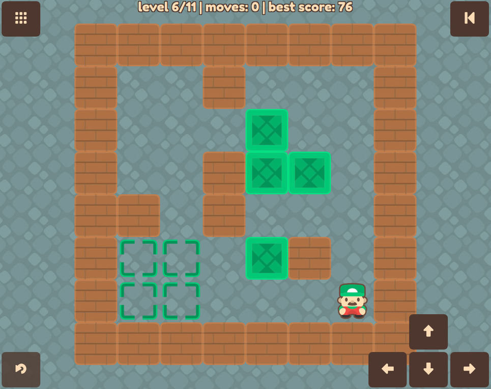

I would like to present you my side project I've been working on for the past few months. I called it Sokoban Player because the idea is that you can play any level you want. You just need to insert it in the [Sokoban Level Format](https://github.com/krzysu/elm-sokoban-player/wiki/Sokoban-Level-Format).

Other features include:

* build and manage your own playlist,
* no login or account required, your levels and scores are stored only in your browser, on your own device,
* works perfectly offline and on mobile devices,
* you can easily share any level,
* levels shared with you are automatically added to your playlist.

Check it out here: [Sokoban Player](https://sokoban-player.netlify.com/)

I would like to recommend you a few nice and easy levels to play as a starter:

* level by Alberto García, from the pack "Alberto García 1-3" - [play it now](https://sokoban-player.netlify.com/G6AHGA4GAH2AGD2GAHA2G2ADAHAGDFAFAHAGD3FAHAGD4AHABGAH4A)
* level by Péter Asztalos, from the pack "A.K.K. Informatika" - [play it now](https://sokoban-player.netlify.com/8AHA2GA3GAHA3GD2GAHA2GA2DGAH2AGA3GAHA2FGDAGAHA2F3GBAH8A)

And one a little bit more challenging:

* level by Thomas Reinke, from the pack "81" - [play it now](https://sokoban-player.netlify.com/2G4AH2GA2G5AH3AGFA3GAHAB2GD4GAHAG2AE5AHA3GD2GAH3AGF2GAH2GA2G3AH2G4A)

I'm looking forward to your feedback! You can find me on [Twitter](https://twitter.com/krzysu).

