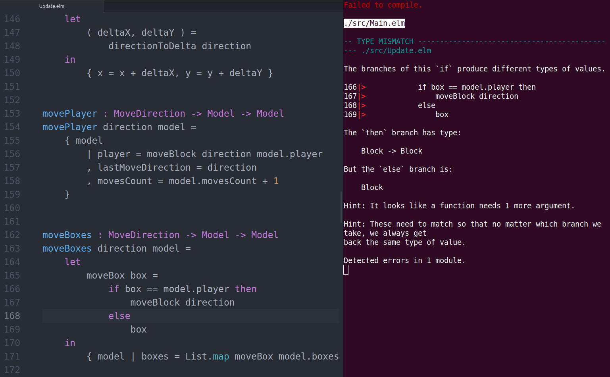
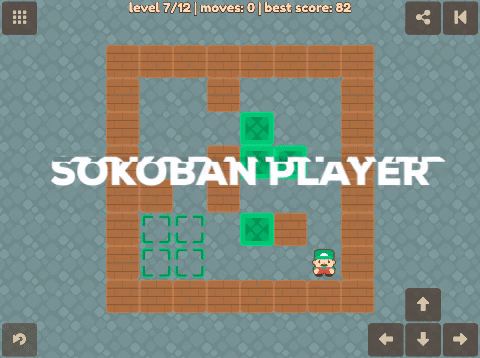

I've heard about [Elm programming language](http://elm-lang.org/) around two years ago. I remember I watched on YouTube some talk from one of the front-end conferences. And I had a WOW moment. I had already experience with React and Redux but **Elm architecture seemed simpler and more precise** (thanks to union types). There is only one way. You trigger action, model updates based on action, the view represents the model. All what you need to build a modern web application.

Redux is based on Elm concept anyway. But JavaScript, in general, allows you to do anything. We developers need to have a strong self-control to keep our code nice and clean. **With Elm you have no other option!**

It took me more than a year to find time and motivation to experience Elm by myself. And it happened only because one day I stumbled upon an announcement of Elm Hack Night in Berlin by [local meetup group](https://www.meetup.com/Elm-Berlin). That time I was not fulfilled as an engineer in my day job so I was open to new challenges on a side. I read through [An Introduction to Elm](https://guide.elm-lang.org/) before attending my first Elm meetup. And with help of people there, I wrote [my first Elm app](https://github.com/krzysu/elm-shopping-cart) in less than 3 hours!

### Compiler is your friend

The first thing you will notice when working with Elm is a compiler. In short, it's great! It leads you by hand and tells you about everything that is still needed to be fixed before your program can compile. In the beginning, I struggled a lot with types. Elm is strongly typed but compiler always helped me with figuring out what is wrong or missing.

I learned fast that **default tools provided with Elm are not enough**. I would not recommend using `elm reactor` for any project outside of "hello world". It runs local development server for you but after every code change, you need to refresh a browser window manually to see an update (or most likely: compiler error report). So far [create-elm-app](https://github.com/halfzebra/create-elm-app) works for me really well. I'm missing SASS support out of the box, but you can always run `elm-app eject` and configure webpack loaders by yourself. However, I avoided that in my projects and just kept with old-school plain CSS.

So with create-elm-app, my workflow looks like on the screen below. On the right side of my screen, I have a terminal with elm-app running. On every change, it recompiles my code and gives me instant feedback. On the left side, I have my code editor. I'm also using [elm-format](https://github.com/avh4/elm-format) which saves me a lot of time. What does it do? It formats my source code based on the official Elm Style Guide on every file save. Great stuff!

### Thinking the functional way

Next thing that you have to embrace is thinking in a functional way. I don't want to write here any details about what functional programming is, but I will give you a few examples that made me think (sometimes really hard). First I got comfortable with pipe (`|>`) operator. It makes chains of your function calls easy to read. Look at the example taken from [here](http://elm-lang.org/examples/pipes/code).

    weirdReversal1 : String -> String
    weirdReversal1 string =
        String.filter isNotSpace (String.toUpper (String.reverse string))

Above code written with pipe operator looks like:

    weirdReversal2 : String -> String
    weirdReversal2 string =
        string
            |> String.reverse
            |> String.toUpper
            |> String.filter isNotSpace

Next interesting learning was that every line of code in Elm has to return something. Even `Debug.log` which logs variable value to the browser console, the same way as `console.log` in JavaScript. So let's say you have a function like above (without pipes as you are completely new in functional programming), and you want to log the value of a string after `String.toUpper` operation. My way of thinking was not functional at all.

    weirdReversal1 : String -> String
    weirdReversal1 string =
        let
            afterUpper =
                String.toUpper (String.reverse string)

            _ =
                Debug.log "log" afterUpper
        in
            String.filter isNotSpace afterUpper

Another try, a little better, as I'm using the result of `Debug.log` and passing to `isNotSpace`.

    weirdReversal1 : String -> String
    weirdReversal1 string =
        let
            afterUpper =
                String.toUpper (String.reverse string)
        in
            String.filter isNotSpace (Debug.log "log" afterUpper)

But when you understand pipes, then it's easy.

    weirdReversal2 : String -> String
    weirdReversal2 string =
        string
            |> String.reverse
            |> String.toUpper
            |> Debug.log "log"
            |> String.filter isNotSpace

**Now it seems obvious to me.** But after years of working with JavaScript, where you can add an extra line with `console.log` in any place, trying to do the same in Elm, required a fundamental shift in my way of thinking.

### Functional vs. procedural

On my journey into the world of functional programming **I got stuck for a while on a problem, which would be otherwise trivial in a procedural way**. I wanted to generate coordinates of all possible fields on my 10x10 game board. Consider this fragment of procedural code in JavaScript.

    var length = 10;
    var coordinates = [];

    for (var x = 0; x < length; x++) {
        for (var y = 0; y < length; y++) {
            coordinates.push({
                x: x,
                y: y
            })
        }
    }

But how to achieve the same in Elm? It took me some time and a lot of head scratching to came up with this:

    getAllCoordinates : Int -> List ( Int, Int )
    getAllCoordinates size =
        let
            lengthAsArray =
                List.range 0 (size - 1)
        in
            lengthAsArray
                |> List.concatMap
                    (\x ->
                        List.map
                            (\y -> ( x, y ))
                            lengthAsArray
                    )

I don't even want to explain the details of this implementation now, but you can see the difference. If you know better or more elegant solution to this problem, let me know, please!

### Continuous refactoring

The biggest project I've built with Elm so far is the [Sokoban Player](https://sokoban-player.netlify.com/). You can find the source code [here](https://github.com/krzysu/elm-sokoban-player).

Along the way **I went through a lot of challenges that required me to learn different aspects of the language**. I tried all possible Elm data structures to model properly data behind my app. I moved from List to Array to Dict and Set to finally end up with Array to keep levels in a player playlist. I used Navigation package to be able to easily share levels and to switch between other pages. I learned about Subscriptions, together with Keyboard and Window packages. I build my own Encoders and Decoders, but that aspect of Elm is still hard to fully grasp for me. I used Commands and ports to store player scores in LocalStorage and handle other Elm limits (I will go back to limitations later). I also wrote quite a lot of tests to cover most critical business logic of my app.

Every new feature in my app required some refactoring. Sometimes bigger, sometimes smaller. But the thing is that you just cannot add any bad code to your Elm app. The compiler won't let you do that! **With every new feature I felt like solving a puzzle.** How to prepare my current code base that I can fit in a new feature easily? That was a lot of fun. And sometimes a big challenge. I refactored underlying data structures a few times along the way. But every time you change things, the compiler is your guide. It won't forget about any place that you might have missed. And finally, it will show you the green message which you are waiting for - "Compiled successfully!"

> **Refactoring in Elm is unavoidable and easy. Both are good things.**

### Know your limits

My current knowledge level of Elm gives me mixed feelings. It is really developer friendly programming language. It forces you to write a good code. It prevents you from causing any runtime errors! Think about it. When your code is accepted by the compiler, built and run on your **static server**, there is no chance that your user will get an exception. You probably have logic bugs in your app or browser specific rendering issues but nothing purely related to code that runs it. No dead ends!

From the other side, web ecosystem is huge. Elm covered only a part of it so far. **You will quickly get to the limits of Elm.** That's when ports come handy. They allow for communication with "external world". In my example I needed to use them to store data to LocalStorage, to scroll the page to an element on a certain action or to hook in Google Analytics. Managing advanced views is also not so nice. Syntax like JSX is way more readable for me, but that's only my taste.

I could think about some hybrid architecture, where Elm is responsible for business logic and exposes an API by ports, to communicate with View built in React... But it's probably a huge over-engineering ;)

My verdict is: **Elm is great for learning, becoming a better programmer, side projects or small commercial projects.** But I would need a lot of convincing from someone better with Elm to agree to use it in a big commercial project. Sorry, let's see Elm version 1.0.

### Looking forward

When I'm writing these words, new version 0.19 of Elm is expected. One of the big new features is **Server Side Rendering**. I'm really looking forward to it. I think that would help my Sokoban Player with initial rendering time and positioning in search engines. I know that Google claims to index and parse also Single Page Apps, but I'm still not happy with my current SEO results.

This was my first technical post on this blog. Let me know how do you like it! You can write me directly on [Twitter](https://twitter.com/krzysu) or comment on [Hacker News](https://news.ycombinator.com/item?id=16464845).

Happy hacking!
