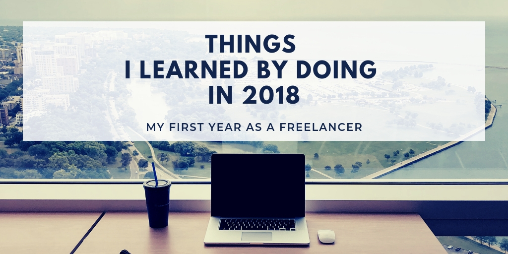

> My first year as a freelancer

Last year 2018 was full of new experiences and (someone could say) risky decisions for me. First of all, I quit my comfortable but boring and not fulfilling full-time job. Second, I took my climbing shoes and laptop and went with my GF backpacking to Southeast Asia for 2 months. Third, I started to offer my skills as a freelancer. That means I started my own small business.

In this context, I would like to share some of my learnings from 2018.

_Background photo by Tanner Van Dera on Unsplash_

## 1. Take regular time off

I'm writing this blog post while backpacking through Java island in Indonesia at the beginning of 2019. This is my second year when I took longer than 1-month vacations. Last year, during my 2 months trip **I realized how refreshing is to take a break and change your life for a while**. When you travel you don't have time for your everyday worries. You try new food, explore new places, meet new people. In between, you have a lot of time to think and reflect on your life. You suddenly have time and mental space for new interests. You find new inspirations and motivation. Do you have any ideas flowing around but you never convinced yourself to try them? Maybe take a month off, temporary change your location, get a fresh wind and go for it. Your employer should also be happy as you will be back re-energized, inspired and motivated.

How did it work for me? **Last year I decided to try freelancing**. I had time to be more active on social media, I wrote a few blog posts. I learned a bit about marketing when promoting my Sokoban Player project. I read a few books. I learned a lot about Southeast Asia and its cultures. I got a new perspective. I cooled down with my professional aspirations. All in 2 months while traveling through 2 big countries, mostly with public transport. This year I'm learning about blockchain. And I'm looking forward to seeing how this will impact my life in 2019.

## 2. No risk no fun (profit)

I took some risks even if I've never really worried about the future. I was unemployed when boarding a plane at the beginning of February 2018. My side project didn't get any interest but to be honest I also didn't take it seriously. My blog posts didn't get much attention either. I had savings for a few months of living.

So I was back in Berlin in April figuring out how to establish myself as a freelancer. I got my first client in a week. It took me 3 weeks to find a tax adviser. It took another 2 months to register my company. I didn't receive any income till the end of July. **Yes, I was unpaid for 6 months**. But that was fine. I was patiently waiting and looking forward to what will happen.

**Being a freelancer requires you to do more**. I learned how to issue invoices and do my taxes. I got a few more insurances. I talked with many potential clients. Imagine you are going through an interview process every 3 to 6 months. You are not paid when you are sick or on vacations. You are first to dispose of if the company or project is not doing well.

But it is all fine. **The more you risk the more you can gain**. I learned a lot and met many great people. I contributed to a few interesting projects and I saw the importance of my work. I felt appreciated for what I was doing. I started to value my free time. For the first few months, I worked 4 days per week. I took vacations whenever I wanted. A position of a contractor gave me a healthy distance to projects I work on. I'm less emotional about them. I'm always doing my best but if a client has a different but strong opinion, fine, I'll do as they want. In the end, they will have to live with a solution to their problem. And finally, I was nicely enumerated for my work. One year later, I feel like I became a happier person. To sum up being a freelancer requires more effort but also gives you better awards for all your hard work.

A lesson for you is that you will never change your life for better if you won't give it a try. There was much said and written about getting out of your comfort zone. That's the only way. Are you comfortable right now in your current position? Great. Would you be also comfortable if your company suddenly went bankrupt or decided they don't need you anymore? Embrace the change. **Changes are always good**. They either improve your life or give you a lesson how to improve it even better the next time you try.

## 3. Work on different projects

I had two clients in 2018. One was a small startup, the second was a well-known international corporation. I've learned significantly more in the last 8 months that over 1.5 years in my previous comfortable full-time position at company ABC (the real name is not important).

ABC had many great engineers. I worked there on a well built and easily maintainable client application. At least that's what I thought till the end of 2018. Some engineers worked there for 4, 6, even 8 years. They had strong opinions about their technologies, workflows, tools etc. I learned a lot from them and I've seen really cool solutions there. Thank you for that. But now I see a few areas they were wrong about. I can see that only because **I stepped outside of their box and joined new projects with even better (or just different) engineers**.

If any engineer from ABC is reading this, I'm sorry to say, but trunk-based development doesn't mean you push everything directly to master. :)

On the side note, I believe you can be an engineer with 6 years of experience or 6 times one year of experience. That's an extreme case, but it's harder to learn new stuff if you are not pushing for it. If you regularly change your projects, you cannot avoid broadening your knowledge and skills. Of course, you can go to tech conferences, read books and blogs, have side projects. We all should be doing it. Anyway, you won't have 100% of your work time for that. New project gives you new people to learn from, new technologies to try, new problems to solve.

Based on my last 4 years of work, I feel like I'm learning for the first 3 to 6 months in a new project. Later it's mostly execution and maintenance. I know it's important and someone has to do that. Just consider if that has to be you ;). **Becoming a freelance software developer put me in a great position to try and learn as much as I possibly can!**

## 4. Use your network

The last lesson was the most surprising for me. When, at the beginning of 2018, I decided to offer my skills as a software consultant, I wanted to build my network of potential clients. To do that, I thought, that I need to show off my skills and knowledge on social media or contribute to some big open source projects. In general, I needed to find a way to put my name out there, for my future clients to easily find me. It all happened to be completely unnecessary.

After coming back to Berlin **I realized that I have already a big network** of ex-colleagues and friends working in many different local startups and companies. And every company with web-based product needs good, trusted frontend developers. Here comes an interesting question: would you rather hire an open source star that you only know from his Twitter posts and Github projects or ex-colleague that you spent a few months coding and hanging out with? Of course, it would be cool to get that famous person to work in your team. The truth is they are more interested in working on their own stuff. I'm not sure if you could afford them anyway. In fact, I know one example where "open source star" happened to be impossible to work with and the team decided to let him go after only a few months.

You should roughly know by now, how it worked for me. I'll give you a bit more details. At the beginning of April, I was looking for my first client. I met a few friends and had a few phone calls with LinkedIn recruiters. I also joined one closed freelancer community on Slack. After one week I had 4 interesting projects on my table to pick from (I rejected a few agency-like projects right away). I decided to support a friend of mine with his new startup. Along the way, I was receiving messages from other friends and ex-colleagues who have already heard that I'm working as a freelancer. One of those messages led me to my second client. All thanks to my existing, real, Berlin-based network.

It's important to add that I spent over 5 years, unconsciously, building that network. I worked in 4 different companies, I had a few side projects, I met many people on meetups and parties. I always did a good job and it seems people liked to work with me.

The lesson is, **reach to your friends and colleagues first before reaching out to the strangers**. You will be surprised how effective your local network is.

## Conclusion

As you might have noticed, since April 2018, I stopped blogging, I stopped twitting, I did very little of open source. **I was just busy working**.

In the beginning, I planned to write about the pros and cons of freelancing. Then I turned them into lessons learned by becoming a freelancer myself. I hope I still covered many areas of living and working on your own.

If you have any questions or comments you can always reach out to me. If you have any interesting project and you think I could be a good fit, let me know.

Now I'm looking forward to what 2019 will bring!
